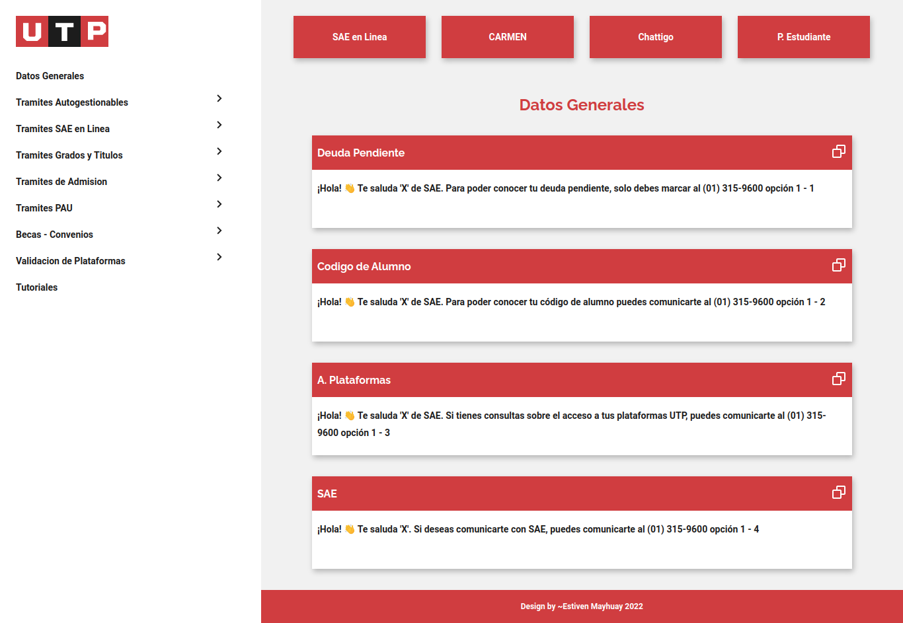

# **UTP CENTER**

Es una plataforma web que permite a los encargados de la atención de los estudiantes poder optimizar tiempo al encontrar la información a solo un **click de distancia**, la información utilizada para el desarrollo de esta plataforma se encuentra disponible en formato **Excel y en Markdown**:

- [plantilla Markdown](data/data.md)
- [excel plantilla utp](data/plantilla_data.xlsm)

> Puedes visitar el despliegue de esta plataforma en el siguiente enlace: **[https://tender-fermi-79ee0c.netlify.app/](https://tender-fermi-79ee0c.netlify.app/)**

## **Vista**

## **Videos**

- [Video Intro](https://www.loom.com/share/08184ee5958b48f4852434a2bbba1702)
- [Video Copy Paste](https://www.loom.com/share/5c3c7eb017a34ab39a3e4b20cd5f3775)

## **Tecnologias**

Entre la gama de tecnologias utilizadas destacan:

- Pug
- CSS3
- JavaScript
- Gulp
- Netlify

## **Referencias**

- [Estructura de carpetas pug](https://github.com/escueladigital/EDboilerplate/tree/master/src/pug/pages)
